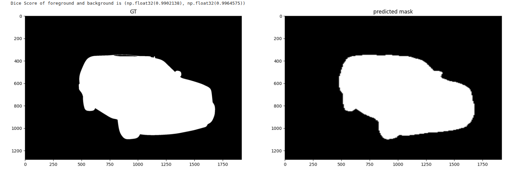

# Carvana-Image-Masking-Challenge

## Given Dataset:
- metadata.csv.zip
- sample_submission.csv.zip
- test.zip
- test_hq.zip
- train.zip
- train_hq.zip
- train_masks.csv.zip
- train_masks.zip

## Efficientnet-b0 

### GT vs Predicted

